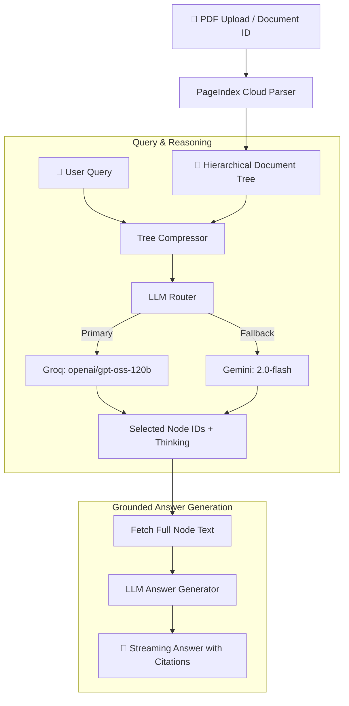

# 🌲 Vectorless RAG Application Using PageIndex

[](https://www.python.org/)
[](https://streamlit.io/)
[](https://groq.com/)
[](https://pageindex.ai/)
[](https://ai.google.dev/)

A production-ready implementation of **Tree-Based Document Retrieval and Reasoning** powered by [PageIndex](https://pageindex.ai/), **Groq** open-source models, and **Google Gemini** fallback.

Traditional RAG slices documents into arbitrary 500-token chunks and maps them into vector space—losing document structure, splitting tables, and polluting search results with out-of-context text fragments. **Vectorless RAG** discards vector databases and embedding models entirely, treating documents as navigable hierarchical trees that LLMs can inspect, reason over, and retrieve from with pinpoint accuracy.

---

## 🌟 Why Vectorless RAG?

| Feature | Traditional Chunk-Based RAG | Vectorless Tree RAG |
| :--- | :--- | :--- |
| **Document Structure** | Destroyed by arbitrary chunking | Preserved as a hierarchical section tree |
| **Embeddings & Vector DB** | Required (Pinecone, Qdrant, Chroma, etc.) | **Zero embeddings, zero vector databases** |
| **Retrieval Mechanism** | Cosine similarity on dense vectors | LLM reasoning over structured outline/summaries |
| **Explainability** | Black-box distance scores | **Full step-by-step thinking & decision logs** |
| **Citations** | Vague or misaligned chunk IDs | **Exact section titles and page numbers** |
| **Domain Rules** | Requires fine-tuning or complex rerankers | Simple text prompt routing rules |

---

## ✨ Key Features

- **🌲 Hierarchical Tree Search**: Uses PageIndex to convert PDFs into structured trees with node IDs, titles, page indices, and summaries.
- **⚡ Dual LLM Provider (Groq + Gemini Fallback)**:
  - **Primary**: Ultra-fast open-source model inference via **Groq** (`openai/gpt-oss-120b`).
  - **Fallback**: Seamless automatic fallback to **Google Gemini** (`gemini-3.1-flash` / `gemini-3.5-flash`) if rate limits or errors occur.
- **🧠 Transparent Reasoning Inspector**: View the LLM's step-by-step decision trail showing *why* specific sections were selected.
- **📌 Exact Grounded Citations**: Every answer directly references original section titles and page numbers.
- **🛡️ Strict File Size Protection**: Built-in 5MB client-side limit to prevent accidental quota exhaustion during public demos.
- **✂️ Page Subset Extraction**: Integrated with `pypdf` to extract and process specific page ranges for large documents.
- **💾 Session Continuity**: Save and re-enter your `Document ID` to resume chatting with previously processed documents without re-indexing.
- **🛠️ Domain Expert Routing**: Inject custom domain rules on the fly (e.g., *"Prioritize Risk Factors section for financial risk questions"*).

---

## 🏗️ Architecture & Workflow



---

## 📁 Repository Structure

```
VectorLess_RAG/
├── app.py                      # Streamlit interactive web application
├── requirements.txt            # Python dependencies
├── .env.example                # Environment variables template
├── test_backend.py             # Connectivity & validation script
└── vectorless_rag/             # Core package
    ├── config.py               # Settings & configuration management
    ├── ingestion.py            # PageIndex upload & polling utilities
    ├── indexing.py             # Tree structure fetching & formatting
    ├── retrieval.py            # Tree compression & LLM node selection
    ├── generation.py           # Context assembly & streaming generation
    ├── pipeline.py             # End-to-end RAG pipeline orchestration
    └── llm/                    # Unified LLM provider layer
        ├── __init__.py         # Router exports
        ├── router.py           # Auto-fallback router (Groq -> Gemini)
        ├── groq_client.py      # Groq client integration
        └── gemini.py           # Google Gemini integration
```

---

## 🚀 Quickstart Guide

### Prerequisites

- **Python 3.10+**
- **PageIndex API Key**: Get it at [dash.pageindex.ai](https://dash.pageindex.ai/api-keys)
- **Groq API Key** (for primary open-source LLM): Get it at [console.groq.com](https://console.groq.com/keys)
- **Google Gemini API Key** (for fallback): Get it at [aistudio.google.com](https://aistudio.google.com/)

---

### Installation

1. **Clone the repository:**
   ```bash
   git clone https://github.com/your-username/VectorLess_RAG.git
   cd VectorLess_RAG
   ```

2. **Set up a virtual environment:**
   ```bash
   # Windows
   python -m venv .venv
   .\.venv\Scripts\activate

   # macOS/Linux
   python3 -m venv .venv
   source .venv/bin/activate
   ```

3. **Install dependencies:**
   ```bash
   pip install -r requirements.txt
   ```

---

### Configuration

Create a `.env` file in the root directory (or copy `.env.example`):

```ini
# Required API Keys
PAGEINDEX_API_KEY=your_pageindex_api_key_here
GEMINI_API_KEY=your_gemini_api_key_here

# Groq Open-Source Provider Settings
GROQ_API_KEY=your_groq_api_key_here
GROQ_MODEL=openai/gpt-oss-120b

# Gemini Model Settings
GEMINI_MODEL=gemini-3.0-flash

# Application Configuration
LLM_PROVIDER=auto              # "auto" (Groq with Gemini fallback), "groq", or "gemini"
MAX_UPLOAD_SIZE_MB=5           # Max PDF upload size limit
PROCESSING_TIMEOUT_SECONDS=300 # Max wait time for PageIndex tree generation
TREE_SUMMARY_CHARS=150         # Characters to retain per node during tree search
```

---

### Running the App

1. **Test your backend connectivity:**
   ```bash
   python test_backend.py
   ```

2. **Launch the Streamlit web app:**
   ```bash
   streamlit run app.py
   ```

3. **Open the interface in your browser:**
   ```
   http://localhost:8501
   ```

---

## 🧪 How to Test & Use

1. **Upload a Document**: Drop a PDF (up to 5MB) into the sidebar uploader. Alternatively, extract a subset of pages if working with large reports.
2. **Inspect the Tree Structure**: Open the **"🌲 View Document Tree Structure"** expander to inspect the structured hierarchy extracted by PageIndex.
3. **Ask Questions**: Type any query in the chat input.
4. **Inspect Reasoning & Sources**: Expand the **"🧠 Retrieval Reasoning & Sources"** box on any answer to see which nodes were chosen and why.
5. **Resume Anytime**: Copy the highlighted **Document ID** (`doc-...`). When you return later, paste it into the **"Enter existing Document ID"** field to reload the tree instantly.

---

## 🛡️ License

This project is licensed under the [MIT License](LICENSE).
